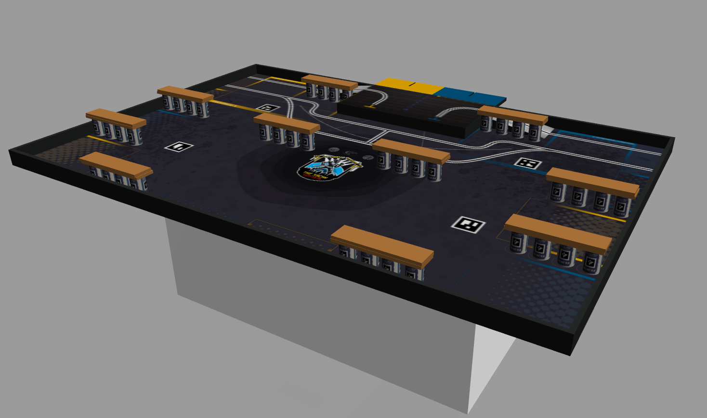

This repository is for the first version of map 2025.

For the simulation,follow these instructions  :

# Running the simulation



Clone the repository:
```bash
git clone -b 2025 --single-branch git@github.com:Betamax58/coupe-de-france.git
```
run commands for the gazebo simulation
```bash
catkin_make
source devel/setup.bash
roslaunch eurobot2025_gazebo eurobot.launch
```


> **Note &#9432; :** for systems with low RAM (<16Gb).
